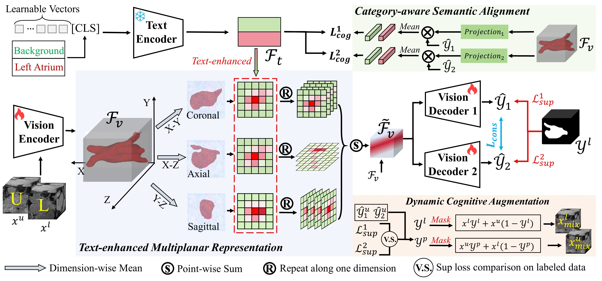

# Text-SemiSeg
Official code for "[Text-driven Multiplanar Visual Interaction for Semi-supervised Medical Image Segmentation](https://arxiv.org/pdf/2507.12382)", which has been **early accepted in MICCAI 2025**.



## Installation

To set up the environment and install dependencies, run:

```bash
pip install -r requirements.txt
```

## Dataset
The original data can be obtained from [Pancreas-CT](https://drive.google.com/drive/folders/1kQX8z34kF62ZF_1-DqFpIosB4zDThvPz?usp=sharing) and [BraTS](https://github.com/HiLab-git/SSL4MIS/tree/master/data/BraTS2019)

To facilitate rapid validation of our method, we provide a download link for the [pre-processed Pancreas-CT](https://drive.google.com/file/d/11uWmtHqnWyNtwptaGLkh9IOVUV_wlfGJ/view?usp=drive_link) dataset.
Please place the dataset into the `data_3D` folder to ensure the directory structure is organized as follows:

```bash
data_3D/
└── Pancreas/
    └── Pancreas_h5
    └── train.list
    └── test.list
```


## Training
To train the model on a dataset, execute:
```bash
python train.py --data_path ./data_3D --dataset /Pancreas
```

## Prediction
After training, you can make predictions using:
```bash
python prediction.py  --data_path ./data_3D --dataset /Pancreas --model_path "best_weight.pth"
```

## Acknowledgements
Our code is based on [SSL4MIS](https://github.com/HiLab-git/SSL4MIS).

## Questions
If you have any questions, welcome contact me at 'taozhou.dreams@gmail.com'
